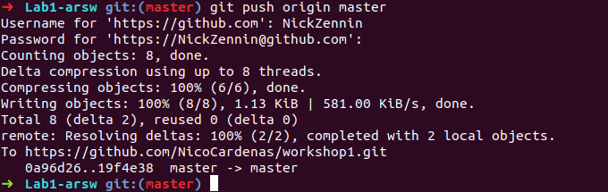

# Workshop 1

### Questions:

> 1. What is the purpose of "git add ." command?
> Answer: the purpose is to update in the index, the changes in the project for the commit command. 

> 2. Why we used it? (git commit -m "Message")
> Answer: the use of this command is to document the changes that be realize in the previous add.

> 3. What is the purpose of the "git push origin master" command?
> Answer: the purpose of the command is to synchronous the local repository to the GitHub repository.

> 4. What is the purpose of "git clone \<repository\> " command?
> Answer: the purpose of this command is to create in a local repository a clone of the original branch.

> 5. What that command does? (Command: git pull origin master)
> Answer: this command synchronous the "global" repository with the local repository.
---
### Screenshot

