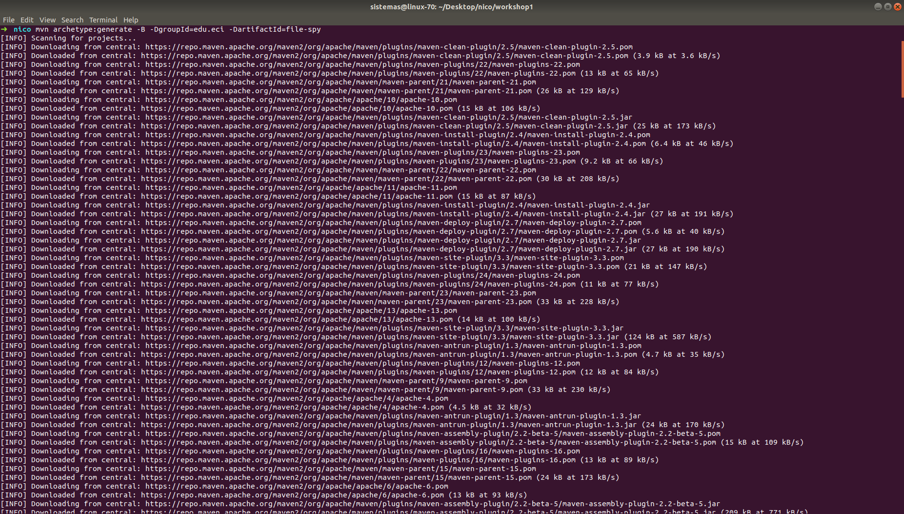
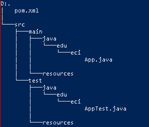
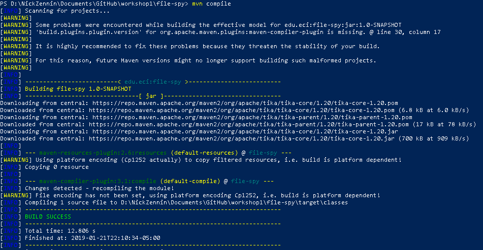
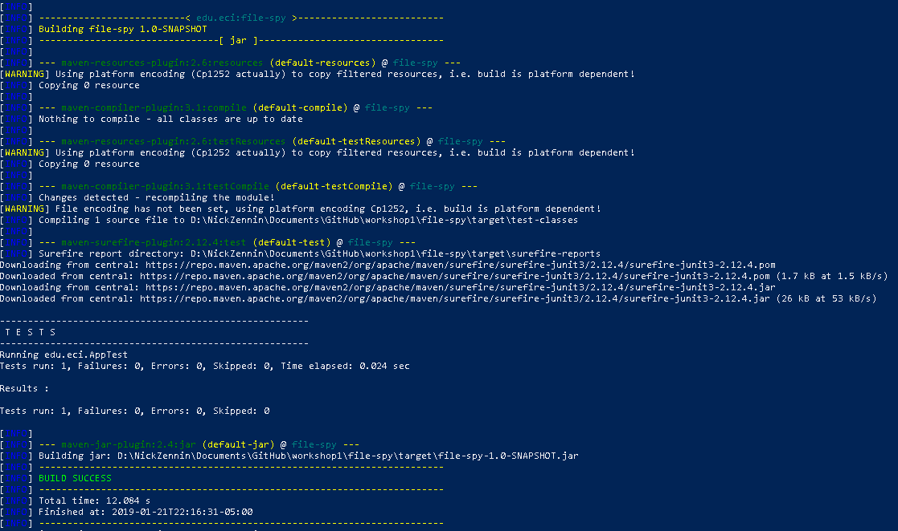
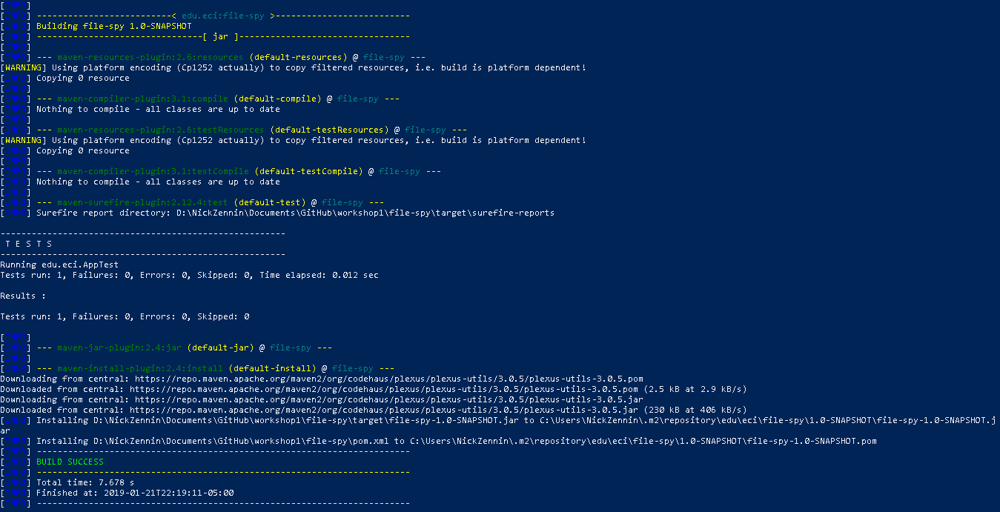
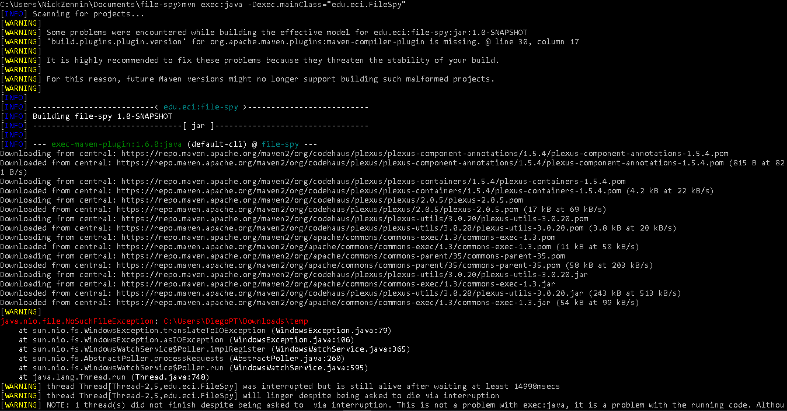
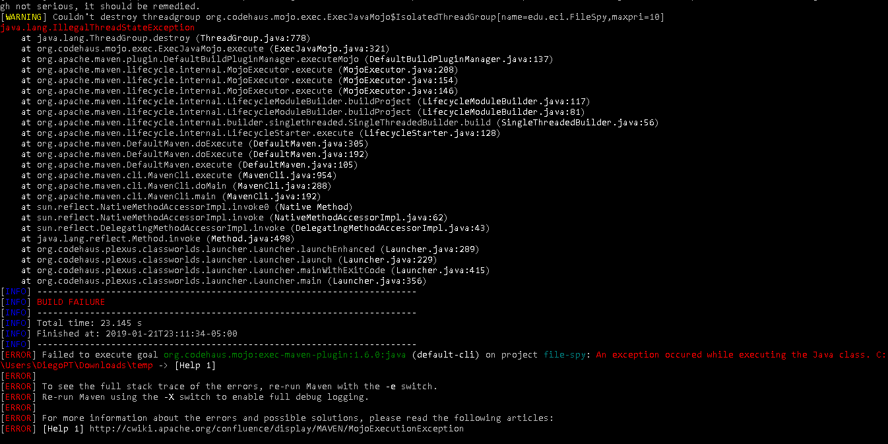

# Workshop 1

## Git Basic

### Questions:

> 1. What is the purpose of "git add ." command?
> **Answer**: The purpose is to update in the index, the changes in the project for the commit command. 

> 2. Why we used it? (git commit -m "Message")
> **Answer**: The use of this command is to document the changes that be realize in the previous add.

> 3. What is the purpose of the "git push origin master" command?
> **Answer**: The purpose of the command is to synchronous the local repository to the GitHub repository.

> 4. What is the purpose of "git clone \<repository\> " command?
> **Answer**: The purpose of this command is to create in a local repository a clone of the original branch.

> 5. What that command does? (Command: git pull origin master)
> **Answer**: This command synchronous the "global" repository with the local repository.

### Create Maven Project
#### Screenshot

> What do means the -B option in the command?
> **Answer**: Means "Generate project in batch mode", is to set interactive property to false.

> What do means the -D option in the command?
> **Answer**: Is to define the properties in the pom.

### POM file
> What do means the groupId, artifactId properties in the command?
> **Answer**: 
> - **groupId**  This element indicates the unique identifier of the organization or group that created the project. The groupId is one of the key identifiers of a project and is typically based on the fully qualified domain name of your organization. For example  org.apache.maven.plugins  is the designated groupId for all Maven plugins.
> - **artifactId**  This element indicates the unique base name of the primary artifact being generated by this project. The primary artifact for a project is typically a JAR file. Secondary artifacts like source bundles also use the artifactId as part of their final name. A typical artifact produced by Maven would have the form <artifactId\>-\<version\>.\<extension\> (for example,  myapp-1.0.jar).

> **Description**: The project structure consist in an system files and a file called pom, the tree structure is shown in the next image.
> 

> What do means the word SNAPSHOT in the version value?
> **Answer**: The SNAPSHOT value refers to the 'latest' code along a development branch, and provides no guarantee the code is stable or unchanging.

> What is the purpose of the packing tag into the POM file?
> **Answer**: Is to define the type of package (e.g. JAR, WAR, EAR, etc.), for default is jar; if packaging is jar, then the package phase will execute the jar:jar goal.

> What is the purpose of the dependencies and dependency tags into the POM file?
> **Answer**: Is to list what dependencies need the maven project to build correctly, the sections are to manage the dependencies.

### Dependency Management
> What is the functionality of this class?
> **Answer**: Is a class that use "Tika Core" dependency, that return the name for the files that are in the local machine, specific file type "text/csv" in one of this directories  "C:\\\Users\\\DiegoPT\\\Downloads\\\temp".

### Building Lifecycles and Plugins

> Description of `clean`, `default`and `site`.
> - clean: This will remove the target directory with all the build data before starting so that it is fresh.
> - default: The default lifecycle handles your project deployment
> - site: This will be generate a web site with the pom information.

> What is `mvn compile` command using for?
> **Answer**: To compile the source code of the project.
> What are transitive dependencies?
> **Answer**: Maven avoids the need to discover and specify the libraries that your own dependencies require by including transitive dependencies automatically.
    

> What is `mvn package` command using for?
> **Answer**: Take the compiled code and package it in its distributable format, such as a JAR.

> What is `mvn install` command using for?
> **Answer**: Install the package into the local repository, for use as a dependency in other projects locally.

### Task
1. `mvn exec:java -Dexec.mainClass="edu.eci.FileSpy"`
> 
> 

## Bibliography

- [Maven started guide](https://maven.apache.org/guides/getting-started/index.html)
- [Maven introduction life-cycle](https://maven.apache.org/guides/introduction/introduction-to-the-lifecycle.html)
- [Maven introduction dependency mechanism](https://maven.apache.org/guides/introduction/introduction-to-dependency-mechanism.html)
